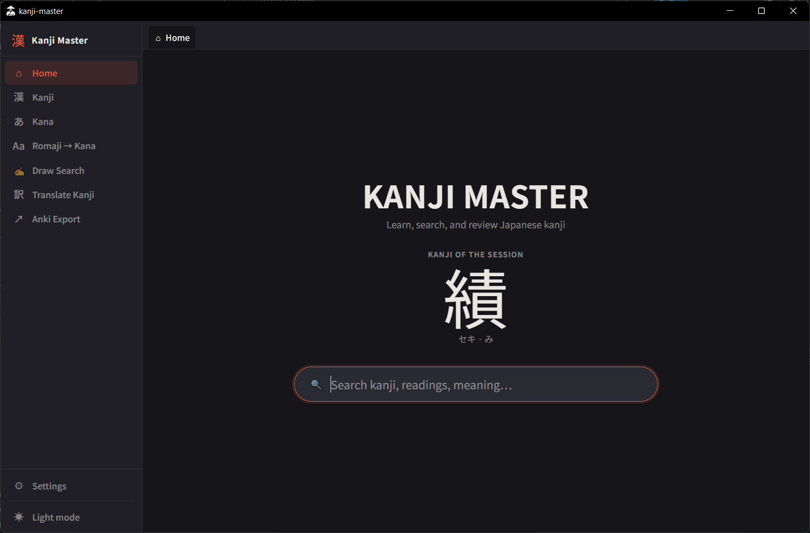
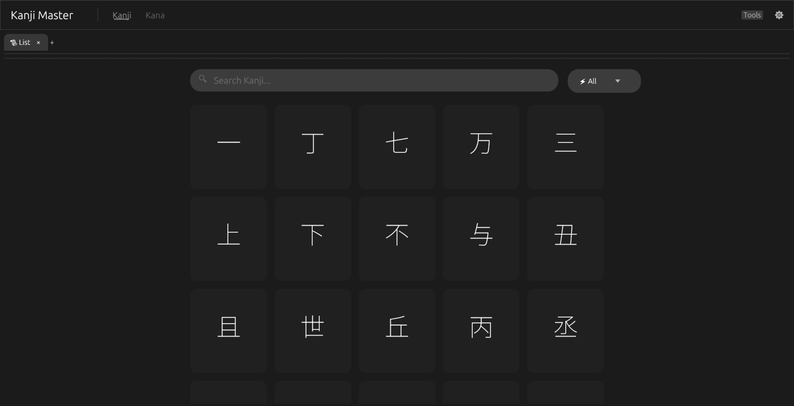
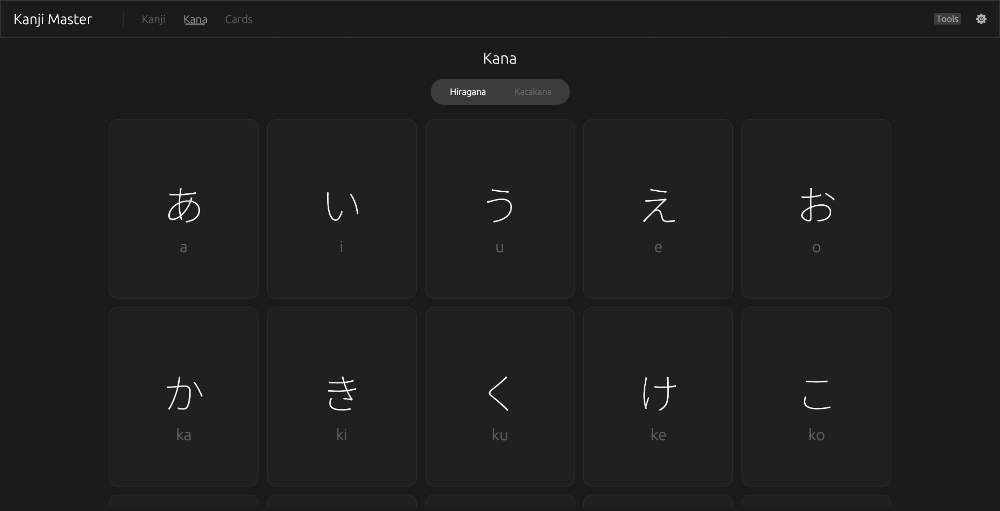
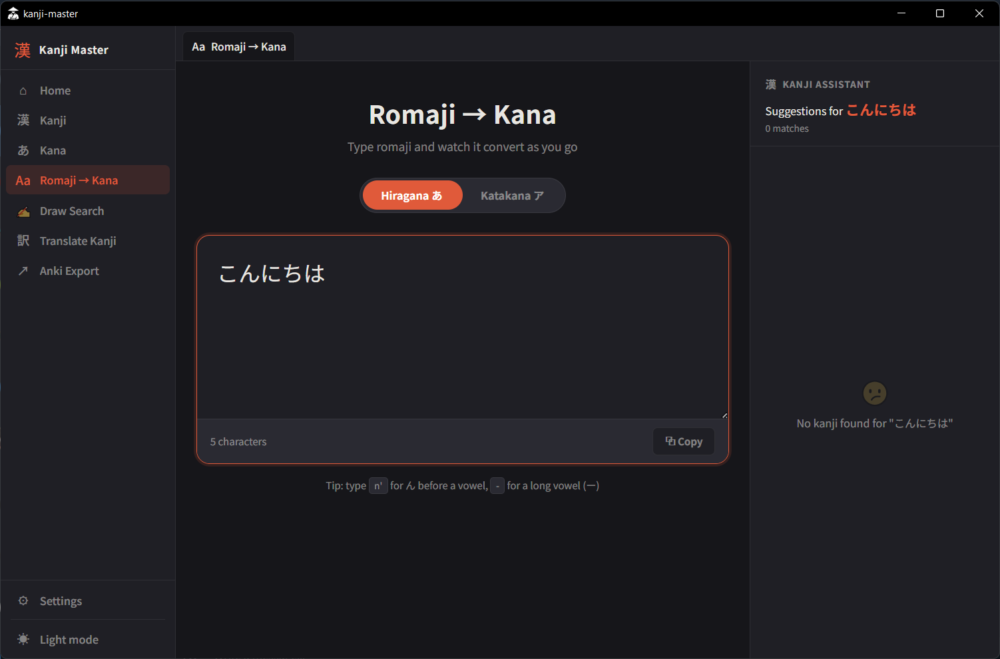
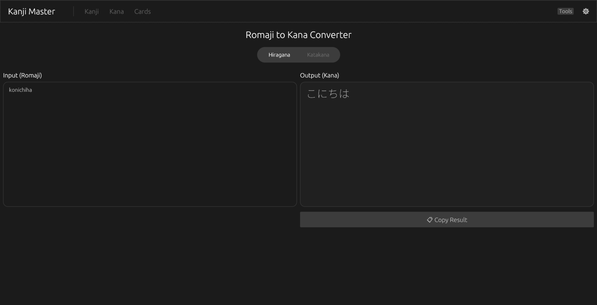

# Kanji Master

**Kanji Master** is a cross-platform desktop application for learning Japanese kanji, written in **Rust**.

---

## Documentation

👉 **[Open Documentation](https://atxxxm.github.io/KANJI-MASTER/)**

---

## Screenshots

